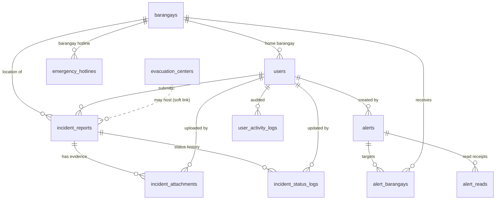

# OBILAK — Database Schema

Database name: **`capstone`** · Engine: **InnoDB** · Charset: **utf8mb4**

This document describes all **12 tables**, their columns, and how they relate.
Import everything from `web/database/capstone.sql`.

---

## Entity-Relationship Diagram

> Solid lines are real foreign keys. The dotted line
> (`evacuation_centers → incident_reports`) is a **soft link**: an incident
> stores an `evacuation_center_id` but there is no enforced foreign key.
> `disaster_types` and `evacuation_centers.barangay` are also referenced by
> **name/value**, not by enforced keys.

---

## Tables

### `users`
All system accounts (admins, coordinators, and barangay accounts).

| Column | Type | Notes |
|--------|------|-------|
| `id` | int, PK, auto | |
| `name` | varchar(100) | Display name |
| `username` | varchar(50), **unique** | Login name |
| `password` | varchar(255) | **bcrypt hash** |
| `role` | enum | `superadmin`, `barangay`, `pcf`, `pho` |
| `barangay_id` | int, FK → `barangays.id` | Only set for barangay accounts |
| `status` | enum | `Active`, `Inactive` |
| `created_at` | timestamp | Defaults to now |

### `barangays`
The 16 barangays of Kalibo, Aklan (with map coordinates).

| Column | Type | Notes |
|--------|------|-------|
| `id` | int, PK, auto | |
| `name` | varchar(100) | |
| `municipality` | varchar(100) | Default `Kalibo` |
| `province` | varchar(100) | Default `Aklan` |
| `status` | enum | `Active`, `Inactive` |
| `latitude` | decimal(12,9) | Used by maps & the weather card |
| `longitude` | decimal(12,9) | |

### `disaster_types`
Lookup list of disaster categories (Typhoon, Flood, Storm Surge, Earthquake,
Landslide, Fire, Drought / El Niño, Disease Outbreak, Accident / Mass Casualty,
Others).

| Column | Type | Notes |
|--------|------|-------|
| `id` | int, PK, auto | |
| `name` | varchar(100) | |
| `status` | enum | `Active`, `Inactive` |

### `incident_reports`
The heart of the system — one row per reported incident.

| Column | Type | Notes |
|--------|------|-------|
| `id` | int, PK, auto | |
| `user_id` | int, FK → `users.id` | Who submitted it |
| `barangay_id` | int, FK → `barangays.id` | Where it happened |
| `disaster_type` | varchar(100) | Matches a `disaster_types.name` |
| `incident_datetime` | datetime | When the incident occurred |
| `exact_location` | varchar(255) | Free-text location *(added column)* |
| `evacuation_needed` | enum | `Yes`, `No` |
| `evacuation_center_id` | int | Soft link → `evacuation_centers.id` |
| `description` | text | |
| `assistance_needed` | text | Free-text needs *(added column)* |
| `latitude` | decimal(10,7) | Map pin |
| `longitude` | decimal(10,7) | |
| `affected_people` | int | Human-impact tally |
| `injured` | int | |
| `dead` | int | |
| `missing` | int | |
| `status` | varchar(50) | Default `Pending` (see status flow below) |
| `referred_to_pho` | tinyint(1) | `0`/`1` flag |
| `created_at` | timestamp | |

**Status flow:** `Pending` → `Verified` → `Responding` → `Referred to PHO` →
`Resolved` (or `Dismissed`). A report can only be **edited by the barangay
while it is still `Pending`**.

### `incident_attachments`
Photo/video evidence attached to a report.

| Column | Type | Notes |
|--------|------|-------|
| `id` | int, PK, auto | |
| `incident_report_id` | int, FK → `incident_reports.id` | **ON DELETE CASCADE** |
| `uploaded_by` | int, FK → `users.id` | |
| `file_name` | varchar(255) | Original file name |
| `file_path` | varchar(255) | Path under `public/uploads/` |
| `file_type` | varchar(50) | `photo` or `video` |
| `file_size` | int | Bytes |
| `created_at` | timestamp | |

### `incident_status_logs`
The timeline of every status change on a report.

| Column | Type | Notes |
|--------|------|-------|
| `id` | int, PK, auto | |
| `incident_report_id` | int, FK → `incident_reports.id` | **ON DELETE CASCADE** |
| `old_status` | varchar(100) | Null for the first entry |
| `new_status` | varchar(100) | |
| `remarks` | text | Optional note |
| `updated_by` | int, FK → `users.id` | |
| `created_at` | timestamp | |

### `evacuation_centers`
Directory of evacuation centers.

| Column | Type | Notes |
|--------|------|-------|
| `id` | int, PK, auto | |
| `barangay` | varchar(100) | Barangay **name** (text, not an FK) |
| `center_name` | varchar(150) | |
| `center_type` | varchar(100) | e.g. School, Covered Court, Barangay Facility |
| `capacity` | int | Default 0 |
| `current_evacuees` | int | Default 0 |
| `status` | enum | `Available`, `Open`, `Full`, `Closed`, `Needs Supplies` |
| `contact_person` | varchar(100) | |
| `contact_number` | varchar(50) | |
| `latitude` | decimal(12,9) | Map pin (nullable) |
| `longitude` | decimal(12,9) | |
| `created_at` | timestamp | |

### `emergency_hotlines`
Municipal and barangay-level emergency contacts.

| Column | Type | Notes |
|--------|------|-------|
| `id` | int, PK, auto | |
| `hotline_scope` | enum | `Municipal`, `Barangay` |
| `barangay_id` | int | Set for barangay-scope hotlines |
| `office_name` | varchar(150) | |
| `municipality` | varchar(100) | |
| `category` | varchar(100) | e.g. PNP, Fire, MDRRMO, Coast Guard |
| `telephone_numbers` | text | Comma-separated |
| `cellphone_numbers` | text | Comma-separated |
| `hotline_number` | varchar(50) | Short hotline (e.g. 159) |
| `remarks` | text | |
| `status` | enum | `Active`, `Inactive` |
| `created_at` | timestamp | |

### `alerts`
Broadcast advisories sent to barangays.

| Column | Type | Notes |
|--------|------|-------|
| `id` | int, PK, auto | |
| `title` | varchar(150) | |
| `alert_type` | varchar(100) | e.g. Flood, Typhoon |
| `severity` | enum | `Low`, `Moderate`, `High`, `Critical` |
| `message` | text | |
| `instructions` | text | Optional safety instructions |
| `status` | enum | `Active`, `Inactive`, `Expired` |
| `start_datetime` | datetime | |
| `end_datetime` | datetime | |
| `target_type` | varchar(30) | `all` or `selected` |
| `created_by` | int, FK → `users.id` | |
| `created_at` | timestamp | |

### `alert_barangays`
Which barangays a `selected`-type alert is aimed at.

| Column | Type | Notes |
|--------|------|-------|
| `id` | int, PK, auto | |
| `alert_id` | int, FK → `alerts.id` | **ON DELETE CASCADE** |
| `barangay_id` | int, FK → `barangays.id` | **ON DELETE CASCADE** |
| `is_read` | tinyint(1) | Default 0 |
| `read_at` | datetime | |

### `alert_reads`
Per-user read receipts for alerts.

| Column | Type | Notes |
|--------|------|-------|
| `id` | int, PK, auto | |
| `alert_id` | int | |
| `user_id` | int | |
| `barangay_id` | int | |
| `read_at` | datetime | Default now |
| | | **Unique** on (`alert_id`, `user_id`) |

### `user_activity_logs`
Audit trail of superadmin account actions (create / update / reset / deactivate
/ reactivate).

| Column | Type | Notes |
|--------|------|-------|
| `id` | int, PK, auto | |
| `actor_id` | int | The admin who acted |
| `actor_name` | varchar(100) | |
| `action` | varchar(50) | e.g. create, update, reset |
| `target_user_id` | int | The affected account |
| `target_username` | varchar(50) | |
| `details` | varchar(255) | Human-readable summary |
| `created_at` | timestamp | |

---

## Foreign Keys (enforced)

| Child table | Column | References | On delete |
|-------------|--------|-----------|-----------|
| `users` | `barangay_id` | `barangays.id` | — |
| `incident_reports` | `user_id` | `users.id` | — |
| `incident_reports` | `barangay_id` | `barangays.id` | — |
| `incident_attachments` | `incident_report_id` | `incident_reports.id` | CASCADE |
| `incident_attachments` | `uploaded_by` | `users.id` | — |
| `incident_status_logs` | `incident_report_id` | `incident_reports.id` | CASCADE |
| `incident_status_logs` | `updated_by` | `users.id` | — |
| `alerts` | `created_by` | `users.id` | — |
| `alert_barangays` | `alert_id` | `alerts.id` | CASCADE |
| `alert_barangays` | `barangay_id` | `barangays.id` | CASCADE |

> Soft links (no enforced FK): `incident_reports.evacuation_center_id`,
> `emergency_hotlines.barangay_id`, `alert_reads.*`, and the text-based
> `incident_reports.disaster_type` / `evacuation_centers.barangay`.
