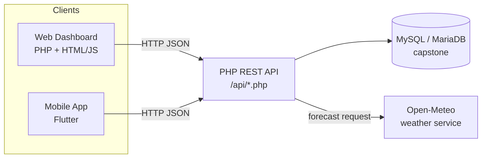

# OBILAK — Barangay Disaster Reporting & Response System

> A reporting and coordination system that connects **barangays** with the
> **Provincial Health Office (PHO)** and coordinators during disasters in
> **Kalibo, Aklan**. Barangays report incidents from a mobile app; the
> municipal/provincial side monitors, verifies, and responds from a web
> dashboard — with maps, evacuation centers, hotlines, broadcast alerts,
> analytics, and live weather.

---

## 1. Overview

During a typhoon or flood, the people on the ground (the barangays) and the
people coordinating the response (PHO / coordinators) often can't see the same
picture at the same time. OBILAK closes that gap:

- **Barangays** submit incident reports (with photos/videos and a map pin) from
  their phones.
- **Coordinators (PHO/PCF)** see every report come in, verify it, update its
  status, and forward serious ones to the Provincial Health Office.
- **Everyone** shares one live view: a map of incidents and evacuation centers,
  an emergency hotline directory, broadcast alerts, and a dashboard that turns
  the raw reports into simple charts.

Think of it as a **shared situation board** for the whole municipality, updated
straight from the field.

---

## 2. Key Features

- 📝 **Incident reporting** — disaster type, description, people affected /
  injured / dead / missing, evacuation needs, map location, and photo/video
  evidence.
- 🗺️ **Live map** — barangay halls, evacuation centers, and incident pins.
- 🏠 **Evacuation centers** — directory with capacity, current evacuees, and
  status (Available / Open / Full / Closed / Needs Supplies).
- ☎️ **Emergency hotlines** — municipal and barangay-level contact directory.
- 📢 **Alerts / broadcasts** — send advisories to all or selected barangays,
  with severity levels and read tracking.
- 📊 **Dashboard analytics** — status breakdown, daily trend, human-impact
  tally, and a disaster-type bar chart, all filterable by month/year.
- 🌤️ **Weather card** — current conditions, a multi-day look-ahead, and a
  heavy-rain / strong-wind heads-up (powered by Open-Meteo).
- 👥 **Role-based access** — different powers for superadmin, barangay, PCF, and
  PHO accounts.
- 🔎 **User-management audit trail** — superadmin actions are logged.

---

## 3. User Roles

| Role | Who they are | What they mainly do |
|------|--------------|---------------------|
| **superadmin** | System administrator | Manage user accounts, view audit trail, full access |
| **barangay** | A barangay account | Submit & edit their own incident reports, view alerts/hotlines/centers |
| **pcf** | Provincial Coordination Facility | Monitor reports, coordinate response |
| **pho** | Provincial Health Office | Monitor reports, handle ones referred to PHO, update status |

---

## 4. Tech Stack

| Layer | Technology |
|-------|------------|
| **Backend / API** | PHP 8 (procedural), served by Apache |
| **Database** | MySQL / MariaDB |
| **Local server** | XAMPP |
| **Mobile app** | Flutter (Dart) |
| **Web dashboard** | PHP + HTML/CSS/vanilla JavaScript (no front-end framework) |
| **Maps** | Leaflet (web) / flutter_map (app) |
| **Weather** | Open-Meteo public API (no key required) |

> Design note: the project deliberately avoids heavy frameworks, CDNs, and
> chart libraries — the charts and UI are hand-built so everything runs locally
> and stays easy to read and maintain.

---

## 5. System Architecture



Both the web dashboard and the mobile app talk to the **same PHP API**, which is
the single doorway to the database. The API also fetches and caches weather from
Open-Meteo.

---

## 6. Project Structure

```
web/                         # PHP backend + web dashboard (XAMPP htdocs)
├─ api/                      # REST API endpoints (see API.md)
│  └─ api_helper.php         # Shared helpers (JSON response, DB, validation)
├─ app/                      # Server-side includes & feature pages
│  ├─ includes/              # check_session, db header, sidebar, weather_helper
│  ├─ alerts/  auth/  evacuation-centers/  hotlines/  reports/  users/
├─ config/
│  └─ db_connection.php      # MySQL connection settings
├─ database/
│  └─ capstone.sql           # Full schema + seed data (import this)
├─ public/                   # Web entry pages (dashboard.php, login, etc.)
│  ├─ asset/                 # CSS, JS, images
│  └─ uploads/               # Uploaded incident evidence (photos/videos)
└─ tools/                    # Maintenance / helper scripts

app/                         # Flutter mobile app
└─ lib/
   ├─ constants/             # api_config.dart, app_colors.dart
   ├─ models/                # Data models
   ├─ screens/               # App screens
   ├─ services/              # API clients (e.g. dashboard_service.dart)
   └─ widgets/               # Reusable widgets (dashboard, weather card, etc.)
```

---

## 7. Setup & Installation

### A. Backend (web + API + database)

1. **Install XAMPP** (includes Apache + MySQL/MariaDB + PHP 8).
2. **Copy the `web/` folder** into your XAMPP `htdocs` directory.
3. **Start Apache and MySQL** from the XAMPP control panel.
4. **Create the database**:
   - Open phpMyAdmin (`http://localhost/phpmyadmin`).
   - Create a database named **`capstone`**.
   - Import **`web/database/capstone.sql`** (this builds all tables and loads
     the 16 Kalibo barangays, disaster types, hotlines, and default accounts).
5. **Check the DB connection** in `web/config/db_connection.php`. Defaults:
   - host `localhost`, user `root`, password *(empty)*, database `capstone`.
6. Open the dashboard at `http://localhost/<your-folder>/public/`.

### B. Mobile app (Flutter)

1. Install Flutter (Dart SDK `^3.12.0`).
2. In **`app/lib/constants/api_config.dart`**, set:
   - `baseUrl` → `http://<your-server-ip>/<your-folder>/api`
   - `fileBaseUrl` → `http://<your-server-ip>/<your-folder>`
   - (Use your computer's LAN IP, not `localhost`, so the phone can reach it.)
3. Run `flutter pub get`, then `flutter run` (or build an APK).

> **Weather note:** the **server** needs internet access to fetch forecasts. It
> caches each result for 30 minutes, so it only calls out a couple of times per
> hour. Offline, the weather card shows the last saved reading or hides itself.

---

## 8. Default Accounts

All seeded accounts use the password **`admin123`**.

| Username | Role |
|----------|------|
| `superadmin` | superadmin |
| `pcfadmin` | pcf |
| `phoadmin` | pho |
| `andagaw`, `bachaw_norte`, … (16 total) | barangay |

> Change these passwords before any real deployment.

---

## 9. Database

The database has **12 tables**. The core ones are `users`, `barangays`,
`incident_reports`, `incident_attachments`, `incident_status_logs`,
`evacuation_centers`, `emergency_hotlines`, `alerts`, and their supporting
tables. See **[DATABASE.md](DATABASE.md)** for the full schema, column-by-column
notes, and an entity-relationship diagram.

---

## 10. API

The app and dashboard communicate through a JSON REST API under `web/api/`.
Every response uses the same shape:

```json
{ "success": true, "message": "...", "data": { } }
```

See **[API.md](API.md)** for every endpoint, its inputs, and example
requests/responses.

---

## 11. Known Limitations

- **No token-based auth yet** — the API identifies the caller through values
  passed in the request body (e.g. `user_id`, `role`, `acting_user_id`) rather
  than a session token. Intended for the local/development setup; add proper
  authentication before any public deployment.
- **CORS is fully open** (`Access-Control-Allow-Origin: *`) for development.
- A few management endpoints are **reserved for a later phase** (see API.md).
- The weather card is a **guide, not an official PAGASA signal**.

---

## 12. Authors / Credits

- Capstone project — *(add team member names here)*
- Weather data: [Open-Meteo](https://open-meteo.com) (free, no API key)
- Maps: OpenStreetMap via Leaflet / flutter_map
