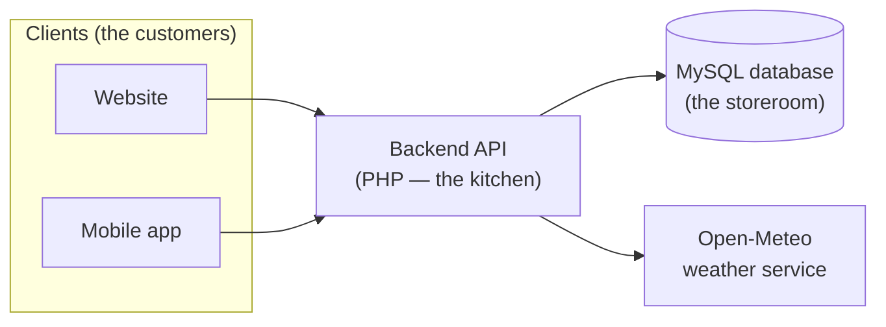

# OBILAK — System Explained (Tech Stack & File Structure)

> A detailed but plain-language explanation of **how the OBILAK system is built**.
> This document looks at the system as **one whole** — its core engine, its
> memory (the database), the technology it's made of, and how the files are
> organized. It focuses on the **backend / database core** rather than walking
> through the web pages or the mobile screens one by one.

---

## 1. The system in a nutshell

OBILAK is built like a **restaurant**:

- The **database** is the *pantry and storeroom* — it holds and remembers
  everything (reports, accounts, alerts, records).
- The **backend** (a set of PHP files called the *API*) is the *kitchen* — it
  takes orders, gets the right items from the storeroom, prepares the answer,
  and sends it back.
- The **clients** (the website and the mobile app) are the *customers at the
  table* — they place orders and receive plates. They never reach into the
  storeroom themselves; they always go through the kitchen.

Because both the website and the mobile app order from the **same kitchen**,
everyone is always served from the **same, single source of information**. This
is the most important idea in the whole system: **one shared brain, one shared
memory.**



---

## 2. How the system is put together (the layers)

The system has three layers, stacked like floors of a building:

1. **The memory layer — the database (MySQL).**
   A single database named `capstone` holds 12 tables. This is the only place
   information is permanently kept. If it's not in the database, the system
   doesn't "know" it.

2. **The engine layer — the backend API (PHP).**
   A folder of small PHP files, each one handling a single job ("log in,"
   "create a report," "get the dashboard numbers"). They are the only ones
   allowed to talk to the database. They take a request, do the work, and hand
   back an answer.

3. **The client layer — the website and the mobile app.**
   These are what people actually look at and tap. They don't store anything
   important themselves; they ask the engine layer for everything.

There is also one **outside helper**: a free weather service (Open-Meteo) that
the engine checks for the forecast.

---

## 3. How a single request works (the core flow)

Everything in OBILAK follows the same simple back-and-forth. Here's what happens
every single time a client needs something:

1. A client sends a **request** to one backend file (for example,
   `login.php`), usually carrying some details (like a username and password).
2. The backend file uses a shared helper (`api_helper.php`) to read those
   details, open the database connection, and run the needed query.
3. The backend always replies in the **same standard "envelope"** — a small,
   predictable package so the clients always know what to expect:

   ```json
   {
     "success": true,
     "message": "Login successful.",
     "data": { "id": 5, "name": "Andagaw Barangay", "role": "barangay" }
   }
   ```

   - **success** — did it work? (true / false)
   - **message** — a short human-readable note.
   - **data** — the actual information requested (or an empty box on failure).

**Two things worth knowing about the core:**

- **Who's asking is sent in the request itself.** The system identifies the
  user by values passed in each request (like `user_id`, `role`, or
  `acting_user_id`) rather than a login token. It's simple and works well on a
  local network; stronger token-based login is noted as a future improvement.
- **The kitchen is open to its own clients.** The backend allows requests from
  the app and website (open CORS). This is fine for the local/classroom setup
  it's built for.

---

## 4. Tech stack (what it's made of, and why)

| Part of the system | Technology used | In plain words |
|--------------------|-----------------|----------------|
| **Backend / API** | **PHP** (procedural style, using `mysqli`) | The "kitchen." Plain, dependable PHP files — one per job — that read requests and talk to the database. |
| **Database** | **MySQL** (managed with **phpMyAdmin**) | The "storeroom." Stores everything in 12 organized tables. Uses `utf8mb4` so it handles all characters safely. |
| **Web server / environment** | **XAMPP** (Apache + MySQL + PHP) | The all-in-one local setup that runs the backend and database on one computer. |
| **Website** | **PHP pages + plain HTML, CSS, JavaScript** | Server-built pages — no heavy frameworks. Charts are **hand-built** (no chart library, no internet CDN needed). |
| **Mobile app** | **Flutter** (the **Dart** language) | One codebase that becomes the phone app. Clean, organized, and fast. |
| **Maps** | **Leaflet** (web) and **flutter_map** (app), with **OpenStreetMap** | Free, open maps for showing incidents and centers as pins — no paid map keys. |
| **Weather** | **Open-Meteo** API | A free weather service (no sign-up key needed) the backend checks and caches. |
| **App building blocks** | Flutter packages: `http`, `image_picker`, `url_launcher`, `geolocator`, `video_player` + `chewie`, `shared_preferences`, `flutter_svg` | Ready-made parts for networking, picking photos, opening links, location, playing videos, and saving small settings. |

**The guiding principle:** keep it **simple, free, and self-contained.** No paid
services, no internet-only libraries — the whole thing can run on one local
machine.

---

## 5. The database core (the system's memory)

The heart of OBILAK is its database. All 12 tables fall into five easy groups:

- **Accounts & places** — *who and where.*
  `users` (every login and their role), `barangays` (the 16 Kalibo barangays
  with their map coordinates), `disaster_types` (the list of disaster
  categories).

- **Incidents — the main event.**
  `incident_reports` (every report filed), `incident_attachments` (the photos /
  videos attached to a report), `incident_status_logs` (the history of how a
  report's status changed, and by whom). This trio is the core of the whole
  system.

- **Resources** — *what's available to help.*
  `evacuation_centers` (places to shelter, and how full they are),
  `emergency_hotlines` (the contact directory).

- **Alerts** — *broadcasting warnings.*
  `alerts` (the warning itself), `alert_barangays` (which barangays it targets),
  `alert_reads` (who has read it).

- **Tracking** — *keeping honest records.*
  `user_activity_logs` (a trail of important admin actions).

These tables connect through shared IDs — for example, every incident report
points back to the barangay and the user that created it. *(For the full
column-by-column details and the relationship diagram, see `DATABASE.md`.)*

---

## 6. File structure

The project has two main parts: **`web`** (the backend, the database, and the
website) and **`app`** (the Flutter mobile app). Here's the layout, then the key
files explained.

### 6a. Folder overview

```
web/
├─ api/          ← THE BACKEND BRAIN: 34 PHP endpoints (one job each) + a shared helper
├─ config/       ← the single database connection settings
├─ database/     ← the database blueprint & seed data (.sql files to import)
├─ public/       ← the website pages people open in a browser
│   ├─ asset/    ← styles, scripts, images for the website
│   └─ uploads/  ← where uploaded incident photos/videos are stored
├─ app/          ← the website's internal building blocks (shared includes + per-feature logic)
│   └─ includes/ ← header, sidebar, footer, shared functions, security, weather helper
└─ tools/        ← one-off maintenance scripts

app/  (Flutter mobile app)
└─ lib/
    ├─ main.dart     ← the app's starting point
    ├─ constants/    ← fixed settings: the server address & the color theme
    ├─ models/       ← the "shapes" of data (what a report, user, alert look like)
    ├─ services/     ← the messengers that call the backend API (one per feature)
    ├─ screens/      ← the actual pages, organized by role (barangay, pcf, pho, superadmin)
    ├─ widgets/      ← reusable UI pieces (cards, buttons, the dashboard view…)
    └─ assets/       ← bundled icons, images, and data
```

### 6b. Key files (what each important one does)

**Backend & database (the core):**

| File | What it does |
|------|--------------|
| `web/api/api_helper.php` | The shared toolbox **every** endpoint uses — reads the request, opens the database, and sends back the standard `{success, message, data}` envelope. |
| `web/config/db_connection.php` | The **single place** the database connection is set up (host, user, database name). Change it here, and the whole backend follows. |
| `web/database/capstone.sql` | The **full database blueprint + starter data.** Importing this one file creates all 12 tables and the default accounts. This is step one of any setup. |
| `web/app/includes/weather_helper.php` | Fetches the weather from Open-Meteo and caches it so the system isn't constantly re-asking. |
| `web/api/login.php`, `create_incident.php`, `get_reports.php`, `get_dashboard_summary.php`… | Each handles **one job.** Their names tell you exactly what they do. *(See `API.md` for every endpoint.)* |

**Mobile app:**

| File / folder | What it does |
|---------------|--------------|
| `app/lib/constants/api_config.dart` | Where the app is told **the backend's address.** If the server moves, this is the one line to update. |
| `app/lib/services/api_service.dart` | The base "messenger" all other services build on — handles sending requests and reading the standard envelope. |
| `app/lib/services/*_service.dart` | One messenger per feature (incidents, alerts, users, dashboard…), each calling its matching backend endpoint. |
| `app/lib/models/*_model.dart` | Define the **shape** of each kind of data so the app handles it safely. |
| `app/lib/widgets/dashboard_summary_view.dart` | The shared dashboard view (charts + weather) used across roles. |

---

## 7. In short

OBILAK is **one system with one brain and one memory**: a **MySQL database**
that remembers everything, a **PHP backend** that does all the real work and is
the only thing allowed to touch that memory, and **two clients** (a website and
a Flutter app) that simply ask the backend for what they need. Every exchange
uses the same simple, predictable envelope. It's built entirely from **free,
self-contained technology** so it can run on a single local machine — simple,
readable, and dependable from top to bottom.
